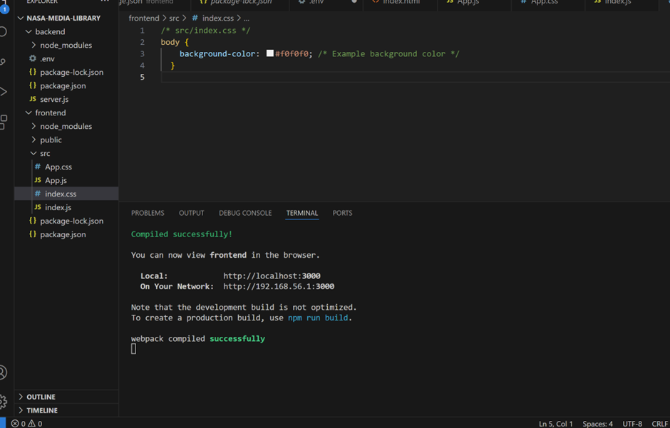
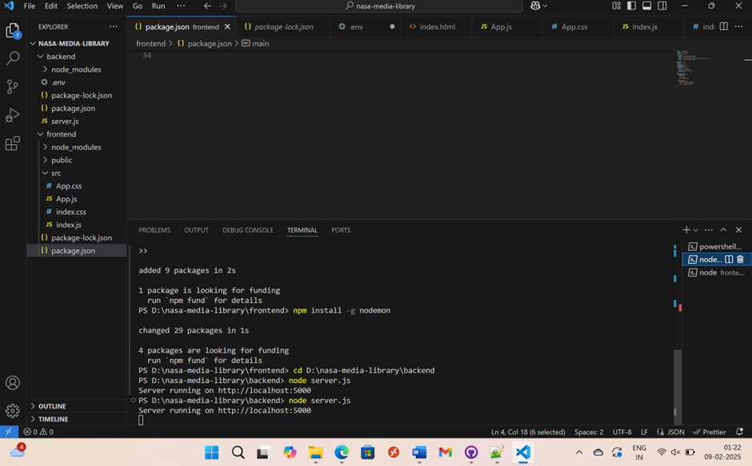
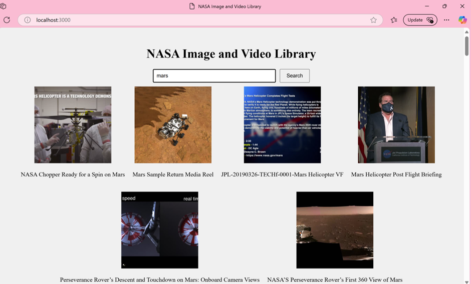

# NASA Media Library Web App

A full-stack web application that allows users to search for and view images and videos from NASA's Image and Video Library API. This project uses **React** for the frontend and **Node.js** with **Express** for the backend.

## Project Structure

```
nasa-media-library/
├── backend/
│   ├── server.js           # API server for backend
│   ├── package.json        # Backend dependencies and scripts
│   ├── .env                # Environment variables (e.g., API keys)
│   └── .gitignore           # Git ignore file for backend
├── frontend/
│   ├── public/
│   │   └── index.html      # HTML file for React app
│   ├── src/
│   │   ├── App.js          # Main React component
│   │   ├── App.css         # App styling
│   │   ├── index.js        # Entry point for React app
│   └── package.json        # Frontend dependencies and scripts
├── .gitignore              # Git ignore file for the project
└── README.md               # Project documentation
```

---

## Setup Instructions

### Frontend Setup (React)

1. **Navigate to the frontend folder:**

   Open a terminal and go to the `frontend` directory:

2. **Install dependencies:**

   Run the following commands to install the necessary packages:

   ```bash
   npm install axios
   npm install -g nodemon
   npm install
   ```

3. **Start the frontend server:**

   Launch the React development server by running:

   ```bash
   npm start
   ```

   The React app will be accessible at `http://localhost:3000`. If the app loads successfully, you're all set up.

### Backend Setup (Node.js with Express)

1. **Navigate to the backend folder:**

   In your terminal, move to the `backend` directory:

2. **Install dependencies:**

   To install the necessary backend packages, use the following commands:

   ```bash
   npm init -y
   npm install express axios cors dotenv
   npm install
   ```

   The `npm init -y` command creates a `package.json` file. The `npm install` commands will install the required dependencies such as `express`, `axios`, `cors`, and `dotenv`.

3. **Set up environment variables:**

   Since the NASA API key is confidential, it is not included in the repository. You will need to create a `.env` file in the `backend` folder and add your NASA API key.

   ```env
   NASA_API_KEY=your_nasa_api_key_here
   ```

   Replace `your_nasa_api_key_here` with your actual NASA API key. You can obtain your API key from the [NASA API documentation](https://api.nasa.gov/).

4. **Start the backend server:**

   Run the following command to start the backend server:

   ```bash
   node server.js
   ```

   The backend will be available at `http://localhost:5000`.

---

## Running the Application

1. **Start both the backend and frontend servers:**

   - **Backend:** In the `backend` folder, run:

     ```bash
     node server.js
     ```

   - **Frontend:** In the `frontend` folder, run:

     ```bash
     npm start
     ```

2. **Open the app in the browser:**

   - Open `http://localhost:3000` in your web browser to view and interact with the frontend.
   - The frontend will make requests to the backend, which in turn fetches data from NASA’s API.

---
## **Front end view if its sucesfull:**


---
- If everything is working correctly, you should see output like this in the terminal
- This indicates that the React development server is up and running on http://localhost:3000..

---


## **Backend view if server running succesfully:**


--- 
- If the server starts without any errors, you should see an output similar to this in the terminal:
- If the server is running properly, you should see a default response, such as a message or a simple confirmation that the server is up and running.

---     

## **Frontend View After Launch**


---

 - A search input field where users can type in a keyword (e.g., "Mars", "Apollo 11", "NASA missions") .
 - A search button next to the input field to trigger the search

---


## Acknowledgments

- [NASA API](https://api.nasa.gov/) for providing the public API to NASA’s media library.

